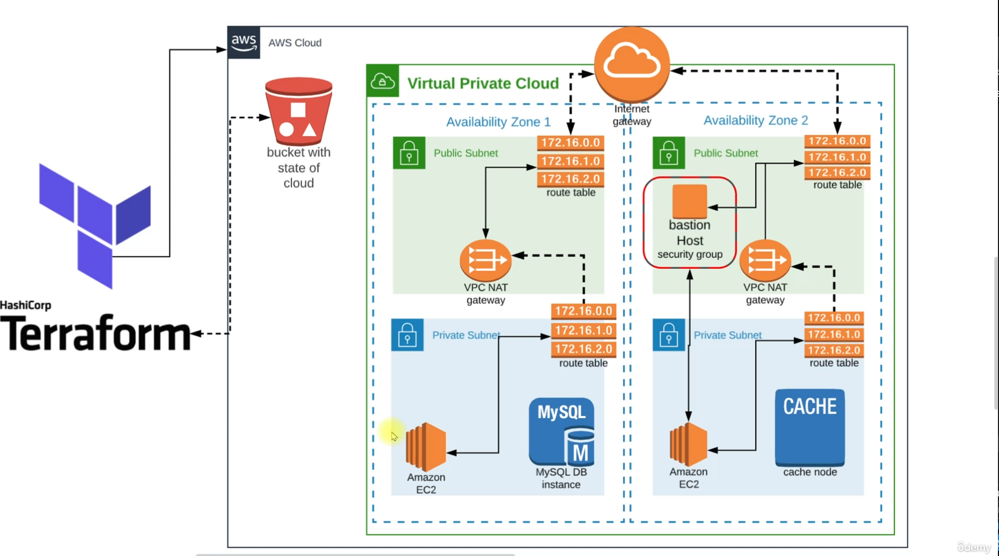

# Terraform-AWS-Deployment

### DevOps工具
- Kubernetes

### AWS 服務
- VPC 
- RDS
- EC2
- Beanstalk 
- Elasticcache
- Amazon MQ  
- Bastion Host

### 以下是 Terraform IaS 自動化流程

1. 在本地電腦上安裝 Terraform，並將State儲存在 S3 Bucket 中。
 

2. 使用 CLI 認證訪問AWS服務，並使用 Terraform 創建 VPC in Multi-AZ。
 

3. 在Multi-AZ中建立Public Subnet，並使用Route Table 連接到 IGW。
 

4. 在Multi-AZ中建立Private Subnet，並在其中設置 EC2 、RDS、ElastiCache 和 AWS MQ Broker。
 

5. Private Subnet透過 Route Table 連接到 NAT Gateway，在轉接到Backend Service。
 

6. 同時設置一個Bastion Host 用於 SSH 連接到 Backend Service 。
 

7. 在 Public Subnet 中設置 Beanstalk，包括Load Balancer 
 